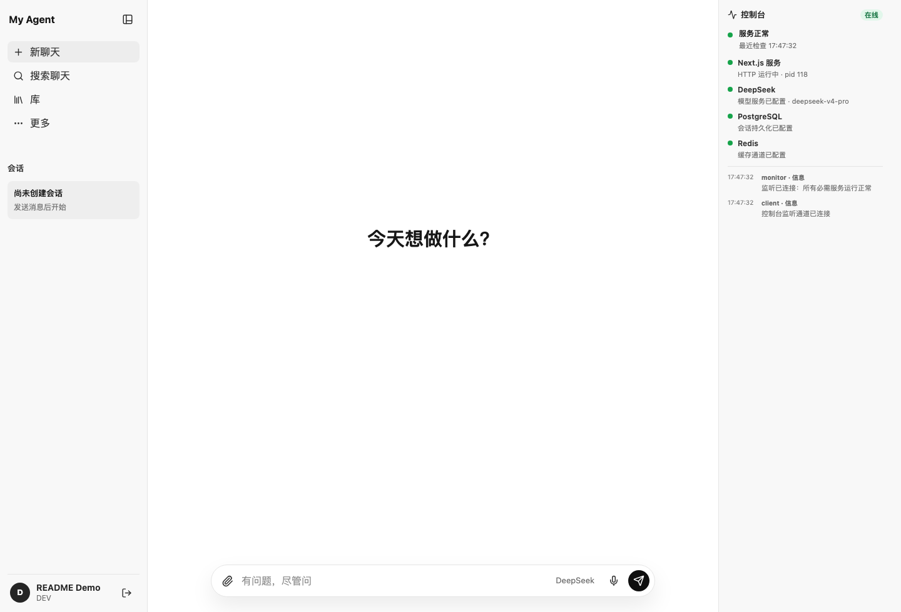
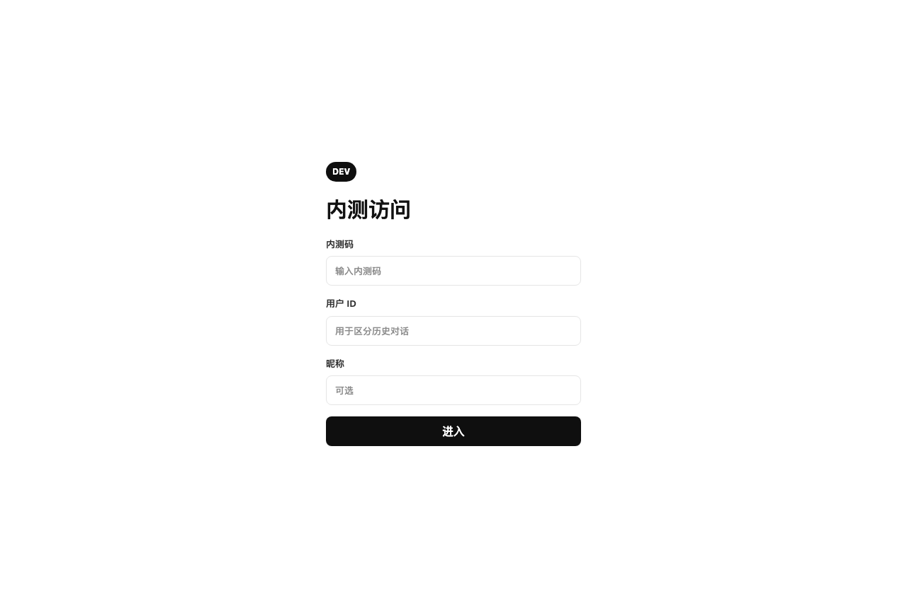
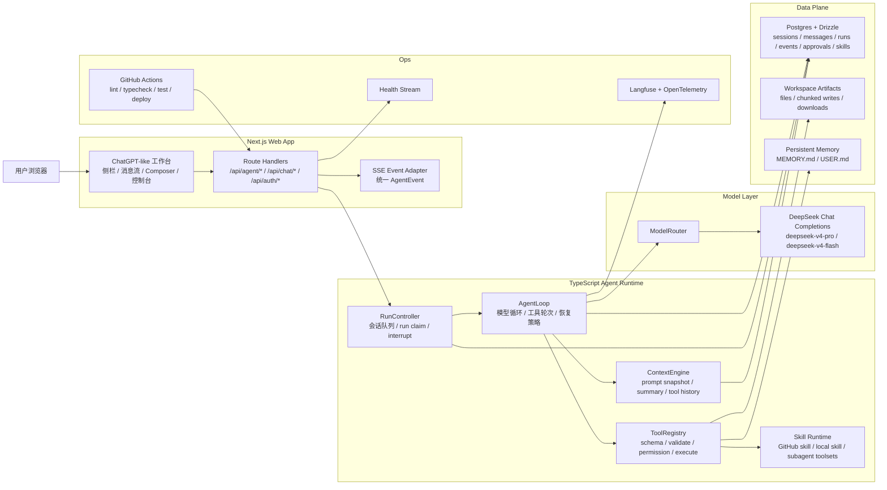
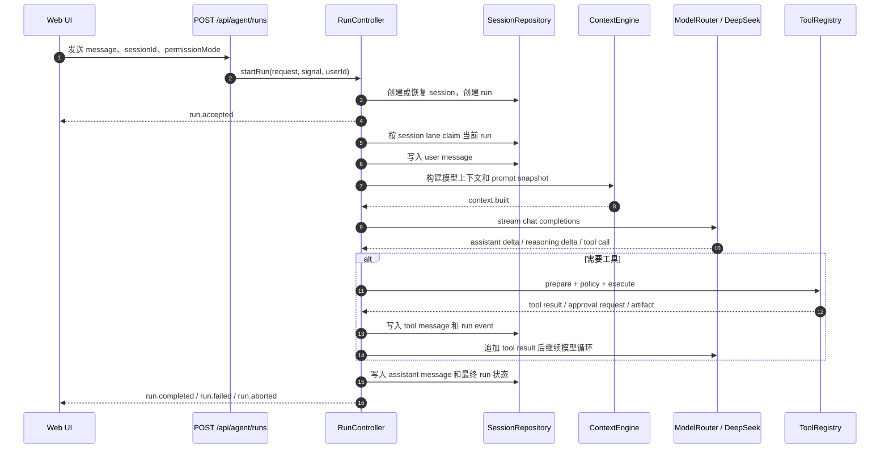
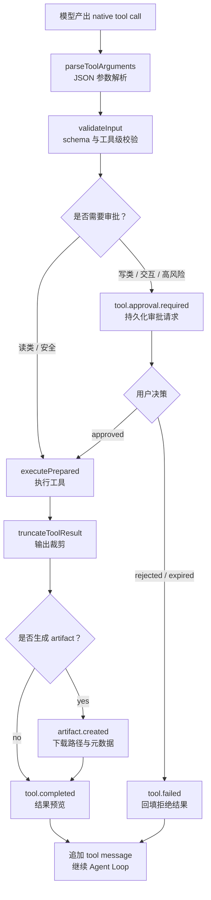

# My Agent

由 DeepSeek 驱动的 ChatGPT-like Web Agent。项目重点不是做一个单轮聊天壳，而是沉淀一套可复用的 TypeScript Agent Runtime：会话事实源、上下文工程、工具调用、审批治理、Skill 运行时、SSE 事件流和本地部署链路都由应用后端统一承载。



## 项目亮点

- **自研 Agent Runtime**：`RunController`、`AgentLoop`、`ContextEngine`、`ToolRegistry` 和 `SessionRepository` 共同管理 run 生命周期、模型调用、上下文构建、工具执行与状态持久化。
- **统一事件协议**：前后端共享 `src/shared/agent-protocol.ts`，后端把 provider stream 转成 `run.*`、`assistant.delta`、`reasoning.delta`、`tool.*`、`task.*`、`artifact.created` 等产品事件。
- **工具安全治理**：模型只能产出 tool call；服务端负责 schema 校验、权限判断、审批等待、审计记录和结果回填。写类文件工具要求先完整读取，再写入或编辑。
- **上下文工程**：稳定 system prompt 由 `PromptAssembler` 拼装；长会话通过 `ContextCompressor` 生成摘要并保留可恢复 lineage；大工具输出优先 artifact 化。
- **Skill 与子任务扩展**：支持 GitHub Skill 安装提案、版本记录、启用/禁用、本地 skill 管理、后台 review 与受限子 Agent 工具集。
- **生产化基线**：Next.js App Router、Postgres/Drizzle、Docker Compose、GitHub Actions、本地 self-hosted runner 部署、Langfuse/OpenTelemetry 适配边界、`npm run ci` 标准验证。

## 截图

| 内测访问 | 桌面工作台 | 移动端工作台 |
| --- | --- | --- |
|  |  |  |

## 架构总览



## Run 生命周期



## 工具治理链路



## 已实现能力

| 领域 | 当前实现 |
| --- | --- |
| Web UI | ChatGPT-like 三栏工作台、内测登录、会话列表、流式消息、Markdown/代码渲染、运行状态、审批面板、服务控制台、移动端 Composer |
| Agent Runtime | run 接收、session lane 串行、`followup` / `interrupt` 队列模式、工具轮次限制、取消检查、协议恢复、上下文溢出恢复 |
| 模型层 | DeepSeek provider 适配、模型路由、thinking 开关、payload sanitizer、可见工具调用纠偏 |
| 上下文工程 | 稳定 prompt 片段、prompt snapshot、会话摘要、压缩子 session、历史 tool call 保留、runtime reminder 净化 |
| 工具体系 | memory、session search、ask user question、task/subagent、web search/extract、file read/write/edit/chunk、skill tools |
| 安全与审批 | 写类工具审批、交互工具等待用户回答、文件路径沙箱、敏感 URL 阻断、用户伪造 runtime reminder 净化 |
| Skill | GitHub skill 发现、安装提案、quarantine、版本化、启用/禁用、本地 skill 创建/编辑、support file 读取 |
| 持久化 | sessions、messages、agent_runs、run_events、tool_approvals、agent_tasks、installed_skills、skill_versions、skill_files 等 Drizzle schema |
| 部署与验证 | Docker Compose、数据库 migration/smoke、GitHub Actions CI、本地 self-hosted runner 部署、`npm run ci` |

## 目录结构

```text
my-agent/
  docs/                         # PRD、技术架构、Agent 后端架构、部署说明
  rules/prompts/system/         # 产品 Agent 的稳定 system prompt 片段
  src/app/                      # Next.js App Router、Route Handlers
  src/components/               # Web 工作台 UI
  src/agent/                    # Agent Runtime、上下文、工具、Skill、会话、事件
  src/server/                   # 服务端配置、数据库、迁移和健康检查
  src/lib/                      # auth、env、DeepSeek、Langfuse、db 适配
  src/shared/                   # 前后端共享协议类型
  drizzle/                      # SQL migration
  scripts/                      # 本地部署脚本
```

## 快速开始

准备 `.env`：

```bash
cp .env.example .env
```

至少配置：

```bash
APP_SESSION_SECRET=replace-with-at-least-32-random-characters
BETA_INVITE_CODES=123456
DEEPSEEK_API_KEY=replace-with-your-deepseek-api-key
DATABASE_URL=postgres://my_agent:change-me@db:5432/my_agent
```

启动本地服务：

```bash
docker compose up -d --build
```

`web` 容器启动时会先执行：

```bash
npm run db:migrate
npm run db:smoke
```

打开：

- Web app：<http://localhost:3000>
- 健康检查：<http://localhost:3000/api/health>

如果在宿主机直接运行 Next.js，请确保 `.env` 中的 `DATABASE_URL` 指向可访问的 Postgres，然后手动执行同样的迁移和 smoke 校验。

## 常用命令

```bash
npm run dev          # 启动 Next.js 开发服务
npm run ci           # lint + typecheck + test
npm run lint         # ESLint
npm run typecheck    # TypeScript 类型检查
npm run test         # node:test 测试
npm run db:migrate   # 执行 Drizzle SQL migration
npm run db:smoke     # 校验数据库表、列、索引和 migration 记录
```

## 关键文档

- [产品需求文档](docs/PRD.md)
- [技术架构图](docs/TECH_ARCHITECTURE.md)
- [Agent 后端架构](docs/AGENT_BACKEND_ARCHITECTURE.md)
- [工具触发题库](docs/TOOL_TRIGGER_QUESTION_BANK.md)
- [部署说明](docs/DEPLOYMENT.md)

## 当前边界

- MVP 主链路使用 DeepSeek Chat Completions，自研 provider-neutral 适配边界仍保留。
- SSE 是默认实时协议；WebSocket/Realtime 只在后续明确场景中引入。
- 写类工具已实现审批闭环；更细粒度的组织权限、计费、多租户治理仍属于后续阶段。
- 文件上传、知识库索引和 pgvector RAG 已在产品设计中定义，但当前工程重点是 Agent Runtime、工具执行、Skill 和会话治理。
- `docs/screenshots/` 中的截图来自本地 `localhost:3000` 渲染，用于说明当前 Web UI 状态。
