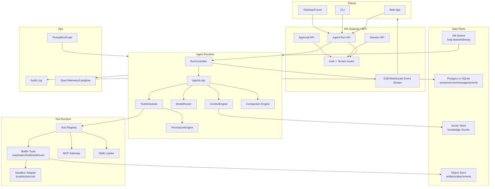

# Claude Code-like Agent 后端架构

设计日期：2026-06-17  
目标版本：MVP v0.1  
目标：在 `my-agent` 中构建一个类似 Claude Code 的 Agent 后端。它应支持多轮编码任务、流式输出、工具调用、权限确认、会话恢复、上下文压缩、MCP/插件扩展，并能从 Web UI、CLI 或未来的桌面端统一调用。

## 1. 参考项目结论

本设计参考当前工作区中的三个项目，但只借鉴架构模式，不复制 Claude Code 泄露源码、专有提示词、品牌文案或受保护实现。

| 参考项目 | 重点文件/文档 | 可借鉴模式 |
| --- | --- | --- |
| Claude Code | `claude-code/src/QueryEngine.ts`、`claude-code/src/query.ts`、`claude-code/src/Tool.ts`、`claude-code/src/services/tools/*`、`claude-code/src/tools/BashTool/*`、`claude-code/src/tools/FileWriteTool/*` | 每个会话一个 QueryEngine；Agent Loop 内部管理消息、工具、权限、中断、重试和压缩；工具统一为 schema + validate + permission + execute + result mapping；读类工具可并发，写类工具串行；文件写入要求先读后写和 mtime 校验。 |
| Hermes Agent | `hermes-agent/run_agent.py`、`hermes-agent/model_tools.py`、`hermes-agent/tools/registry.py`、`hermes-agent/hermes_state.py`、`website/docs/developer-guide/*` | 中央工具注册表、toolset 分组、工具可用性检查、会话 SQLite/FTS、Gateway 多入口、Context Engine、技能系统、MCP 网关、背景记忆/技能复盘、provider 多模式适配。 |
| OpenClaw | `openclaw/docs/concepts/agent-loop.md`、`openclaw/docs/concepts/context.md`、`openclaw/docs/concepts/compaction.md`、`openclaw/docs/plugins/architecture.md`、`openclaw/docs/gateway/sandboxing.md` | Gateway 作为控制面；Agent run 事件流；按 session lane 串行执行；插件 capability 模型；workspace/bootstrap 文件注入；沙箱模式；compaction 与 session pruning 分离；配置 schema 严格校验。 |

综合建议：`my-agent` 先做 TypeScript 模块化单体，保留 Worker 拆分边界。Web/BFF、Agent Runtime、Tool Runtime、Context Engine、Session Store 放在同一仓库内，运行压力或长任务变多后再拆出 `agent-worker`。

## 2. 设计目标与非目标

### 2.1 目标

- 支持 Claude Code-like 编码 Agent：读文件、搜索、编辑、运行命令、生成 patch、执行测试、总结结果。
- 支持 Web UI/CLI/未来桌面端共享同一个后端运行时。
- 浏览器只连自己的 API，不暴露模型 Key、工具凭据、系统提示词和权限规则。
- 后端拥有完整 Agent Loop：模型调用、工具执行、权限确认、上下文构建、压缩、重试、审计、观测。
- 所有工具调用都能被流式观察、审计、取消，并能在高风险动作前等待用户确认。
- 设计时支持多 provider，但 MVP 可默认 DeepSeek/OpenAI-compatible Chat Completions。

### 2.2 非目标

- 不直接二开 Claude Code 泄露代码。
- MVP 不做完整插件市场、团队多租户计费、移动端实时语音。
- MVP 不追求完全本地离线；可预留本地模型和远程沙箱接口。
- MVP 不允许模型绕过工具策略直接执行宿主机危险操作。

## 3. 总体架构



核心边界：

- `API Gateway`：只做认证、请求接收、事件转发、审批交互，不写复杂 Agent 决策。
- `Agent Runtime`：唯一的 Agent 状态机，负责 run/turn/step 的生命周期。
- `Tool Runtime`：工具定义、参数校验、权限、执行、结果裁剪、审计的统一出口。
- `Context Engine`：决定每次模型调用看到什么，不让 UI 或工具随意拼 prompt。
- `Session Store`：产品事实源。模型 API 是无状态的，不能当作会话状态源。

## 4. 核心领域模型

| 实体 | 含义 | 持久化建议 |
| --- | --- | --- |
| `AgentDefinition` | Agent 名称、说明、系统指令、默认模型、默认工具集、权限模式、上下文策略 | `agents` 表或配置文件 |
| `Session` | 一段可恢复的对话。绑定用户、项目、workspace、默认 agent、session key | `sessions` |
| `Run` | 用户一次提交触发的完整 Agent 执行。可能包含多次模型调用和多次工具调用 | `agent_runs` |
| `Turn` | Run 内一次模型响应周期。模型可能产出文本或 tool calls | 可由 events/messages 推导，MVP 可不单独建表 |
| `Step` | Agent Loop 的原子步骤：build context、call model、execute tools、compact、finalize | `run_steps` 或事件流 |
| `Message` | system/user/assistant/tool 的规范化消息 | `messages` |
| `ToolCall` | 模型请求的工具调用，含状态、参数、审批、结果、错误 | `tool_calls` |
| `Artifact` | 文件、patch、报告、图片、命令输出文件等大结果 | `artifacts` + 对象存储 |
| `ContextSnapshot` | 某次模型调用的上下文摘要、token 估算、工具 schema 列表、压缩状态 | `context_snapshots` |
| `AuditEvent` | 权限、工具、模型、配置变更的审计日志 | `audit_events` |

`Run` 状态机：

```text
queued
  -> preparing
  -> streaming_model
  -> waiting_approval
  -> executing_tools
  -> compacting
  -> finalizing
  -> completed

terminal states:
  completed | failed | aborted | expired
```

每个 `Session` 同一时间只允许一个 active run。后续用户输入进入 session queue，队列模式可参考 OpenClaw：

- `steer`：当前工具批次结束后，把新输入插入下一次模型调用。
- `followup`：当前 run 完成后作为下一次 run。
- `interrupt`：中止当前 run，立即处理新输入。
- `collect`：只收集，不自动触发。

MVP 默认 `followup`，编码场景建议支持 `interrupt`。

## 5. 推荐目录结构

```text
my-agent/
  docs/
    AGENT_BACKEND_ARCHITECTURE.md
    PRD.md
    TECH_ARCHITECTURE.md
  src/
    app/                       # Next.js App Router 或 API 入口
      api/
        agent/runs/
        agent/sessions/
        agent/approvals/
    server/
      auth/
      config/
      db/
      events/
    agent/
      runtime/
        RunController.ts
        AgentLoop.ts
        RunState.ts
        errors.ts
      context/
        ContextEngine.ts
        PromptAssembler.ts
        TokenBudget.ts
        CompactionEngine.ts
        ContextFiles.ts
      models/
        ModelRouter.ts
        ProviderAdapter.ts
        providers/
          deepseek.ts
          openaiCompatible.ts
          anthropic.ts
      tools/
        Tool.ts
        ToolRegistry.ts
        ToolScheduler.ts
        ToolResultStore.ts
        toolsets.ts
        builtin/
          readFile.ts
          searchFiles.ts
          editFile.ts
          writeFile.ts
          applyPatch.ts
          execCommand.ts
          listDirectory.ts
      permissions/
        PermissionEngine.ts
        Policy.ts
        ApprovalStore.ts
        riskClassifier.ts
      sandbox/
        SandboxAdapter.ts
        local.ts
        docker.ts
        ssh.ts
      mcp/
        McpGateway.ts
        McpToolAdapter.ts
      skills/
        SkillRegistry.ts
        SkillLoader.ts
      sessions/
        SessionRepository.ts
        MessageRepository.ts
        TranscriptWriter.ts
      observability/
        tracing.ts
        audit.ts
        usage.ts
```

MVP 可以先不创建全部文件，但模块边界应按这个方向保持。

## 6. Agent Loop（执行循环）

### 6.1 执行流程

```mermaid
sequenceDiagram
  autonumber
  participant UI as Client
  participant API as Run API
  participant RC as RunController
  participant LOOP as AgentLoop
  participant CTX as ContextEngine
  participant LLM as ModelProvider
  participant TOOL as ToolScheduler
  participant DB as SessionStore

  UI->>API: POST /api/agent/runs
  API->>DB: create user message + run
  API-->>UI: run.accepted + stream id
  API->>RC: start run
  RC->>LOOP: execute run
  LOOP->>CTX: build context snapshot
  CTX-->>LOOP: messages + tools + token report
  LOOP->>LLM: streaming model call
  LLM-->>LOOP: text deltas / tool call deltas
  LOOP-->>UI: assistant.delta / tool.call.created
  alt model requested tools
    LOOP->>TOOL: execute tool batch
    TOOL-->>UI: tool.started/progress/completed
    TOOL->>DB: persist tool results
    LOOP->>CTX: append tool messages and rebuild context
    LOOP->>LLM: continue model call
  else final answer
    LOOP->>DB: persist assistant message and usage
    LOOP-->>UI: run.completed
  end
```

### 6.2 Loop 伪代码

```ts
async function runAgent(runId: string, signal: AbortSignal) {
  const run = await runs.markPreparing(runId)
  const session = await sessions.loadForUpdate(run.sessionId)
  const state = await buildInitialRunState(run, session)

  while (!state.done) {
    enforceMaxTurns(state)
    enforceBudget(state)

    const context = await contextEngine.build({
      session,
      run,
      messages: state.messages,
      tools: state.availableTools,
    })

    if (context.shouldCompact) {
      await compactor.compact(session, context)
      continue
    }

    const modelStream = modelRouter.stream({
      model: state.model,
      messages: context.modelMessages,
      tools: context.toolSchemas,
      signal,
    })

    const assistant = await collectAssistantOrToolCalls(modelStream, state)

    if (assistant.toolCalls.length === 0) {
      await finalizeAssistantMessage(run, assistant)
      return completeRun(run)
    }

    const toolResults = await toolScheduler.executeBatch({
      toolCalls: assistant.toolCalls,
      context: state.toolUseContext,
      signal,
    })

    state.messages.push(assistant.message, ...toolResults.messages)
  }
}
```

关键点：

- Agent Loop 是唯一能把 tool result 追加回模型上下文的地方。
- `stop_reason === tool_use` 一类 provider 字段不能作为唯一依据；应以流中是否出现 tool call 为准。
- 模型请求失败时先分类：可重试、可 fallback、需要 compaction、不可恢复。
- Abort 必须同时取消上游模型请求、待执行工具、子 agent 和队列锁。

## 7. 模型适配层

内部统一使用 provider-neutral 消息：

```ts
type AgentMessage =
  | { role: "system"; content: string }
  | { role: "user"; content: ContentPart[] }
  | { role: "assistant"; content: ContentPart[]; toolCalls?: ToolCallRequest[]; reasoning?: string }
  | { role: "tool"; toolCallId: string; name: string; content: string; isError?: boolean }
```

`ProviderAdapter` 负责：

- 把内部消息转成 DeepSeek/OpenAI-compatible/Anthropic/Responses 等 provider 格式。
- 把 provider stream 转成统一事件：text delta、reasoning delta、tool call delta、usage、error。
- 暴露 provider capabilities：`supportsTools`、`supportsParallelToolCalls`、`supportsReasoning`、`supportsPromptCache`、`maxInputTokens`、`maxOutputTokens`。
- 处理 provider 级 fallback、429/5xx 重试、context overflow 识别。

MVP 默认：

- `openaiCompatibleAdapter`：支持 DeepSeek、OpenRouter、自建 OpenAI-compatible。
- `ModelRouter`：根据 agent 配置选择 primary/fallback，失败时按错误类型切换。
- 模型特殊参数只能在 adapter 内处理，Agent Loop 不直接依赖 provider 私有字段。

## 8. Context Engine（上下文引擎）

Context Engine 决定模型看到的全部内容。建议分层：

1. `stable`：基础系统提示、Agent 行为规范、工具使用原则、安全规则。
2. `workspace`：`.hermes.md` / `HERMES.md`、`CLAUDE.md`、`.cursorrules`、项目规则、当前 cwd。`AGENTS.md` 是本仓库开发协作指令，不注入产品 Agent 的 system prompt。
3. `skills`：技能索引，只放名称/描述/路径；完整技能按需用 `skill_view/read` 加载。
4. `memory`：长期记忆、用户偏好、项目摘要。
5. `history`：会话消息、工具调用、最近结果。
6. `retrieved`：RAG、session search、web search 的片段。
7. `ephemeral`：本次 run 的预算提醒、时间、UI 指令、队列 steering 输入。

设计原则：

- 稳定前缀尽量不变，提升 provider prompt cache 命中。
- 工具输出视为不可信，进入上下文前必须标注来源，防止 prompt injection。
- 大工具输出不直接塞回上下文，存 artifact，只回传预览和路径。
- 上下文文件要做注入扫描、大小上限、head/tail 截断。
- 记录 `ContextSnapshot`，用于 debug `/context`、成本分析和回归评测。

当前 MVP 的 system prompt 已按 Claude Code-like 的工程 agent 质量要求拆成多个稳定片段，并由 `PromptAssembler` 拼装成 XML-like 标签结构：

- `identity.md`：身份、语言、协作方式和不编造原则。
- `runtime-guidance.md`：服务端运行边界、模型能力声明、压缩续接规则。
- `interaction-contract.md`：用户可见输出、Markdown、系统标签、hook/权限反馈和 URL 约束。
- `context-discipline.md`：上下文层级、项目文件来源、prompt injection 和隐藏配置保护。
- `tool-guidance.md`：工具使用、失败重试、外部数据降权。
- `software-engineering-guidance.md`：读后再改、遵循项目模式、控制改动范围、安全编码。
- `file-operation-guidance.md`：文件读写前置条件、精确编辑、保留用户改动。
- `planning-guidance.md`：何时直接行动、何时调查后计划、何时等待批准。
- `task-management.md`：复杂任务拆解、进度状态、阻塞口径。
- `delegation-guidance.md`：子 agent/并行研究的适用场景、输入要求和结果核验。
- `action-safety.md`：可逆性、危险操作确认、密钥保护、保留用户改动。
- `verification-guidance.md`：按风险验证、如实汇报通过/失败/未运行。
- `git-collaboration.md`：提交前检查、精确 staging、禁止破坏性 git 操作。
- `skills-guidance.md`、`memory-guidance.md`、`platform-webui.md`：技能、记忆和 Web UI 输出协议。

## 9. Compaction 与 Token Budget

MVP 需要三层保护：

1. `tool result pruning`：旧工具结果超过阈值时替换为摘要或 artifact 引用，不改写 transcript。
2. `auto compaction`：上下文超过阈值时，总结中间历史，保留最近 tail，tool call/result 不拆开。
3. `reactive compaction`：provider 返回 context overflow 后，压缩并重试一次。

压缩前应提醒或自动触发 memory flush，把长期有用信息写入 memory/project summary。压缩结果应作为一条 compact summary message 持久化，原始 transcript 保留。

建议默认阈值：

| 项 | 默认 |
| --- | --- |
| 自动压缩阈值 | context window 的 70% |
| protected recent messages | 最近 20 条或最近 20% token |
| 工具结果最大内联字符数 | 20,000 |
| 每个 run 最大轮数 | 50 |
| 每个 run 最大工具调用数 | 100 |

## 10. Tool Runtime（工具运行时）

### 10.1 Tool 接口

```ts
type ToolRisk = "read" | "write" | "execute" | "network" | "destructive" | "external_send"

interface ToolDefinition<Input, Output> {
  name: string
  aliases?: string[]
  description: string
  toolset: string
  inputSchema: ZodSchema<Input>
  outputSchema?: ZodSchema<Output>
  maxResultSizeChars: number
  risk: ToolRisk[]
  isEnabled(ctx: ToolAvailabilityContext): Promise<boolean>
  isReadOnly(input: Input): boolean
  isConcurrencySafe(input: Input): boolean
  validateInput(input: Input, ctx: ToolUseContext): Promise<void>
  checkPermissions(input: Input, ctx: ToolUseContext): Promise<PermissionDecision>
  execute(input: Input, ctx: ToolExecutionContext): AsyncGenerator<ToolProgress, ToolResult<Output>>
  mapResult(result: Output, ctx: ToolUseContext): AgentMessage
}
```

工具必须经过：

1. schema 校验。
2. 输入规范化，比如路径展开、cwd 限制、shell 命令解析。
3. 工具级 validate。
4. 权限策略。
5. 执行。
6. 输出裁剪、artifact 化、审计。

### 10.2 MVP 内置工具

| 工具 | 能力 | 权限默认 |
| --- | --- | --- |
| `list_directory` | 列目录 | allow |
| `read_file` | 读文件，支持 offset/limit | allow，但受 workspace 限制 |
| `search_files` | rg/glob 搜索 | allow |
| `write_file` | 新建/覆盖文件 | ask，且要求先读后写 |
| `edit_file` | 基于精确匹配或 patch 的小范围编辑 | ask，要求先读后写 |
| `apply_patch` | 应用 unified patch | ask |
| `exec_command` | 执行 shell 命令 | read-only 命令可 allow，写/网络/危险命令 ask |
| `process_status` | 查看后台进程 | allow |
| `web_search` | 联网搜索 | allow/ask 由项目策略控制 |
| `skill_view` | 加载技能文档 | allow |
| `delegate_task` | 启动子 agent | ask 或限额 allow |

### 10.3 调度策略

- 连续 read-only/concurrency-safe 工具可并发执行，最大并发默认 5。
- write/execute/destructive 工具串行执行。
- 工具结果按模型原始 tool call 顺序写回上下文，即使并发执行完成顺序不同。
- 某个并发工具失败时：
  - read-only 工具失败不必取消兄弟工具。
  - destructive/execute 工具失败应停止后续写工具。
- 支持 streaming tool execution：模型 tool call 参数完整后可提前启动工具，但 fallback 或 abort 时必须丢弃孤儿结果。

### 10.4 文件安全

文件写工具必须实现 Claude Code-like 的保护：

- 写入绝对路径前先解析到 workspace 内真实路径。
- 对已存在文件，要求本 run 或本 session 已 `read_file` 完整读取过该文件。
- 写入前比较文件 mtime/hash，若用户或格式化器已改动，要求重新读取。
- 拒绝写入 `.env`、密钥、系统目录、`.git` 内部对象等默认 deny path。
- patch 工具展示 diff，并记录 changed lines。

### 10.5 命令安全

`exec_command` 不应只是 `child_process.exec` 包一层。需要：

- 命令 AST/语义分类：read、list、test、install、write、delete、network、privileged。
- 危险模式检测：`rm -rf`、`curl | sh`、`sudo`、`dd`、`mkfs`、`chmod -R`、密钥读取、系统服务操作。
- 超时、输出上限、后台运行、进程表。
- 可选 sandbox。
- 用户审批支持 once/always/deny。

## 11. 权限与审批

权限模式：

| 模式 | 行为 |
| --- | --- |
| `read-only` | 只允许读工具和安全搜索，拒绝写/执行 |
| `ask-on-write` | 读默认 allow，写/执行 ask |
| `auto-safe` | 低风险写操作可由策略自动允许，高风险 ask |
| `plan` | 不执行写/命令，只产出计划 |
| `bypass` | 开发者本地调试用，生产禁用 |

`PermissionDecision`：

```ts
type PermissionDecision =
  | { behavior: "allow"; reason: string; updatedInput?: unknown }
  | { behavior: "deny"; reason: string }
  | { behavior: "ask"; approvalId: string; summary: string; risk: ToolRisk[] }
```

审批流程：

1. ToolScheduler 调用 PermissionEngine。
2. 若返回 `ask`，run 状态变为 `waiting_approval`，向客户端发 `tool.approval.required` 与 `tool.confirmation.required`。
3. 用户调用 `POST /api/agent/approvals/:id/resolve`。
4. Scheduler 继续或生成 tool error message。
5. 所有决策写入 audit log。

## 12. 沙箱

MVP 可先只做 `local`，但接口必须能替换：

```ts
interface SandboxAdapter {
  prepare(scope: SandboxScope): Promise<SandboxHandle>
  exec(handle: SandboxHandle, command: ExecRequest): AsyncIterable<ExecEvent>
  readFile(handle: SandboxHandle, path: string): Promise<FileContent>
  writeFile(handle: SandboxHandle, path: string, content: string): Promise<void>
  dispose(handle: SandboxHandle): Promise<void>
}
```

推荐策略：

- 个人 main session 本地运行可选，但 Web/远程入口默认 sandbox。
- 非 main session、群聊、webhook、子 agent 默认 sandbox。
- Docker 是第一优先级；SSH/远程沙箱作为 P1/P2。
- 沙箱 workspace 和宿主 workspace 的同步策略要明确：host-canonical、remote-canonical 或 mirror。

## 13. Session Store（会话存储）

Web 产品建议用 Postgres；本地 CLI-only 可用 SQLite。Postgres 表建议：

```sql
users(id, email, created_at)
projects(id, owner_id, name, workspace_root, created_at)
agents(id, project_id, name, config_json, created_at)
sessions(id, project_id, agent_id, user_id, title, status, parent_session_id, created_at, updated_at)
messages(id, session_id, role, content_json, tool_call_id, token_count, created_at)
agent_runs(id, session_id, user_id, status, model, permission_mode, started_at, ended_at, error_json)
run_events(id, run_id, seq, type, payload_json, created_at)
tool_calls(id, run_id, message_id, name, input_json, status, approval_id, result_json, started_at, ended_at)
artifacts(id, session_id, run_id, kind, uri, metadata_json, created_at)
approvals(id, run_id, tool_call_id, status, request_json, decision_json, created_at, resolved_at)
audit_events(id, actor_id, session_id, run_id, action, payload_json, created_at)
```

搜索：

- Postgres 用 `tsvector` + `pg_trgm`，支持英文、中文 substring、tool name、tool args。
- 保留 `session lineage`：压缩、branch、delegate 子任务通过 `parent_session_id` 串起来。
- transcript 采用 append-only events，避免并发覆盖。

## 14. 事件流协议

前端不要消费 provider 原始 chunk，应消费统一事件。
当前 TypeScript source of truth 是 `src/shared/agent-protocol.ts`，前端和后端都应从这里复用事件类型。

```ts
type AgentEvent =
  | { type: "run.accepted"; runId: string; sessionId: string }
  | { type: "run.started"; runId: string }
  | { type: "context.built"; snapshotId: string; tokenEstimate: number }
  | { type: "system.reminder.persisted"; messageId: string; runId: string; sanitized: boolean }
  | { type: "context.compaction.started"; beforeTokenEstimate: number; reason: "proactive" | "reactive" }
  | { type: "context.compacted"; summaryMessageId: string; compactedMessageCount: number; reason?: "proactive" | "reactive" }
  | { type: "payload.sanitized"; runId: string; insertedMissingToolResults: number; removedOrphanToolResults: number; invalidToolArguments: number }
  | { type: "protocol.recovery"; runId: string; reason: "visible_tool_call" | "duplicate_answer_prefix" | "context_too_long"; retryAttempt: number; toolName?: string }
  | { type: "assistant.delta"; messageId: string; text: string }
  | { type: "assistant.delta.retracted"; messageId: string; text: string }
  | { type: "reasoning.delta"; messageId: string; text: string }
  | { type: "tool.started"; runId: string; toolCallId: string; toolName: string; argumentsPreview?: string }
  | { type: "tool.approval.required"; runId: string; approvalId: string; toolCallId: string; toolName: string; reason: string; risk: string }
  | { type: "tool.confirmation.required"; runId: string; confirmationId: string; toolCallId: string; toolName: string; message: string }
  | { type: "tool.completed"; runId: string; toolCallId: string; toolName: string; durationMs?: number; resultPreview?: string }
  | { type: "tool.failed"; runId: string; toolCallId: string; toolName: string; durationMs?: number; error: string }
  | { type: "usage.updated"; inputTokens?: number; outputTokens?: number; costUsd?: number }
  | { type: "run.completed"; runId: string; finalMessageId: string }
  | { type: "run.failed"; runId: string; error: string }
  | { type: "run.aborted"; runId: string; reason: string }
```

传输：

- MVP：SSE，简单稳定。
- P1：WebSocket，用于审批、双向 steering、实时工具进度。
- 所有事件带 `seq`，客户端断线后可从 `lastEventId` 补读。

## 15. Skills、MCP 与插件

### Skills（技能）

技能是轻量 procedural memory：

- `skills/**/SKILL.md` 存说明和步骤。
- system prompt 只注入技能索引。
- Agent 明确需要时调用 `Skill` 工具读取完整技能正文或支持文件。
- 技能可声明 `tools`、`when_to_use`、`references`。

GitHub Skill 安装是受治理的包管理能力，不是把远端 Markdown 直接拼进 prompt：

- `install_github_skill` 解析 `github.com` repo/path/ref，固定到 commit SHA，通过 GitHub Contents API 下载选中目录，进入 quarantine 并生成安装提案。
- `activate_skill_install` 是写操作，必须走工具审批；审批 payload 包含 source URL、commit SHA、proposal id、trust level 和版本目录。
- 激活后文件进入用户作用域的 active skills 目录，`SkillIndex` 只暴露短索引；完整正文仍需 `Skill` 工具按需加载。
- 安装状态、版本、文件清单、权限策略和审计事件分别落在 `installed_skills`、`skill_versions`、`skill_files`、`skill_permissions` 和 `skill_audit_events`。
- 用户安装的 Skill、支持文件、脚本、模板和资源都按外部不可信上下文处理，不能提升工具权限、覆盖 system prompt 或绕过审批。
- session prompt snapshot 带 Skill Index 签名；安装、启用、禁用或卸载 Skill 后，新 run 会刷新 snapshot，避免旧会话看不到新能力。
- GitHub 下载必须拒绝路径穿越、绝对路径、symlink/submodule、超大 bundle、平台不兼容和缺失根级 `SKILL.md` 的包。
- 验收命令：`RUN_GITHUB_SKILL_E2E=true npx tsx --test src/agent/skills/GithubSkillAgentFlow.e2e.test.ts`。该测试会真实输入“下载 GitHub skill 并安装后使用”，自动审批，验证下载、启用、加载和应用闭环。

Agent 自我改进循环参考 Hermes 的 background review：

- 每个 run 完成后，`AgentLoop` 异步触发 `BackgroundReviewAgent`，不阻塞用户响应，也不把复盘 prompt 写入主会话历史。
- `MEMORY_REVIEW_INTERVAL` 按用户轮次触发 memory review；默认每 10 个用户轮次检查一次稳定事实，只开放 `memory` 工具。
- `SKILL_REVIEW_INTERVAL` 按累计 tool-calling iteration 触发 skill review；默认每 10 次工具迭代检查一次可复用流程，只开放 `skills_list`、`skill_view`、`Skill`、`list_installed_skills` 和 `skill_manage`。
- `skill_manage` 支持 `create`、`edit`、`patch`、`write_file`、`remove_file`。写入必须进入用户作用域 active skills 目录，并同步记录 `installed_skills`、`skill_versions`、`skill_files` 与 `skill_audit_events`。
- 前台调用 `skill_manage` 仍按写操作走审批；后台 review 使用受限工具集直接写入，但 prompt 明确禁止保存任务进度、临时错误、密钥、一次性叙事和删除 skill。

### MCP（模型上下文协议）

MCP Gateway 负责：

- 加载 MCP server 配置。
- 拉取 tool schema。
- 把 MCP tool 包装成内部 `ToolDefinition`。
- MCP 输出同样经过权限、结果上限、审计。
- MCP auth/error/elicit 转成统一事件。

### 插件

P1 后引入 manifest：

```json
{
  "id": "github",
  "name": "GitHub Tools",
  "capabilities": ["tools", "provider", "hooks"],
  "tools": ["dist/tools.js"],
  "hooks": ["dist/hooks.js"],
  "configSchema": "schema.json"
}
```

插件 capability 边界参考 OpenClaw：provider、tool、channel、memory、context-engine、web-search、embedding 等能力分开注册。

## 16. 子 Agent 与长任务

`delegate_task` 不应只是普通函数工具，它需要 Agent Runtime 支持：

- 子 agent 拥有自己的 `Run`、`Session`、tool budget、permission mode、sandbox scope。
- 父 agent 只接收子 agent 的 summary、artifacts、关键引用，不继承全部 transcript。
- 子 agent 默认不能弹审批 UI；需要审批时回传给父 run 或自动 deny。
- 并行子 agent 需要全局并发上限和预算上限。

长任务：

- MVP 可同步执行。
- P1 接入队列：BullMQ/Inngest/Trigger.dev/Temporal 任选其一。
- 长任务 run 可断线继续，事件写入 `run_events`，客户端重新订阅。

## 17. 可观测与评测

每次 run 记录：

- trace id、session id、run id、user id。
- 模型、provider、参数、fallback。
- context token 估算、真实 usage、cache hit。
- 工具调用数量、耗时、错误、审批决策。
- 压缩次数和压缩前后 token。
- final status 和错误分类。

建议：

- OpenTelemetry 记录通用 trace。
- Langfuse 或自建 LLM trace 记录 prompt 版本、模型结果、成本。
- Promptfoo 做回归集：文件编辑、命令安全、RAG、工具失败恢复、prompt injection。
- 所有日志默认脱敏，工具输入输出按字段标记敏感性。

## 18. API 设计

MVP API：

| Method | Path | 说明 |
| --- | --- | --- |
| `POST` | `/api/agent/runs` | 创建 run，写入用户消息，返回 run id 和 stream url |
| `GET` | `/api/agent/runs/:runId/events` | SSE 订阅事件 |
| `POST` | `/api/agent/runs/:runId/abort` | 中止 run |
| `POST` | `/api/agent/approvals/:approvalId/resolve` | 允许/拒绝工具 |
| `GET` | `/api/agent/sessions` | 会话列表 |
| `GET` | `/api/agent/sessions/:sessionId` | 会话详情 |
| `GET` | `/api/agent/sessions/:sessionId/messages` | 消息历史 |
| `POST` | `/api/agent/sessions/:sessionId/share` | 为当前用户会话生成只读分享 token |
| `GET` | `/api/agent/shared/:token` | 无登录态读取分享 token 对应的只读会话片段 |
| `POST` | `/api/agent/sessions/:sessionId/compact` | 手动压缩 |
| `GET` | `/api/agent/tools` | 当前可用工具和权限 |
| `GET` | `/api/agent/skills` | 当前用户已安装、禁用和待启用的 Skill |
| `PATCH` | `/api/agent/skills/:skillId` | 启用、禁用或卸载 Skill |

`POST /api/agent/runs` 请求示例：

```json
{
  "sessionId": "sess_123",
  "agentId": "coding",
  "message": "修复登录接口测试失败的问题",
  "model": "deepseek/default",
  "permissionMode": "ask-on-write",
  "queueMode": "followup",
  "attachments": []
}
```

## 19. MVP 实施路线

### Milestone 1：运行时骨架

- 定义 `AgentMessage`、`AgentEvent`、`RunState`、`ToolDefinition` 类型。
- 实现 `RunController`、`AgentLoop` 空工具版本。
- 实现 SSE 事件流和 run persistence。
- 接入一个 OpenAI-compatible provider adapter。

验收：能完成无工具多轮流式聊天，并持久化消息。

### Milestone 2：工具系统

- 实现 ToolRegistry、ToolScheduler、PermissionEngine。
- 内置 `list_directory`、`read_file`、`search_files`。
- 增加 `write_file`、`edit_file`、`apply_patch` 的 ask 权限。
- 实现工具事件和审计日志。

验收：Agent 能读项目文件、提出编辑、等待用户确认后落盘。

### Milestone 3：命令执行与沙箱

- 实现 `exec_command`、超时、输出上限、后台进程。
- 实现危险命令检测和审批。
- 抽象 SandboxAdapter，先接 local，再接 Docker。

验收：Agent 能运行测试，并对写/删/网络/危险命令弹审批。

### Milestone 4：上下文与压缩

- 加载 `.hermes.md` / `HERMES.md`、`CLAUDE.md`、`.cursorrules`、项目规则；不加载 `AGENTS.md`。
- 实现 ContextSnapshot、token budget、tool result pruning。
- 实现手动 `/compact` 和 auto compaction。

验收：长会话不会轻易爆上下文，压缩后可继续完成任务。

### Milestone 5：MCP、Skills、子 Agent

- 实现 skill index + `skill_view`。
- 实现 MCP Gateway。
- 实现 `delegate_task` 子 agent，带 budget 和 sandbox。

验收：Agent 能按需加载技能，调用 MCP 工具，并并行分解研究/编码任务。

### Milestone 6：生产化

- 补 OTel/Langfuse/Promptfoo。
- 完成权限策略配置、配置 schema 校验。
- 引入队列和 Worker。
- 做安全红队用例和恢复测试。

## 20. 关键决策

- 先做模块化单体，不直接拆微服务。
- 后端拥有 Agent Loop，不把复杂 loop 放前端。
- 数据库是事实源，provider API 只是推理引擎。
- 工具统一 registry，所有工具都走 schema/permission/audit。
- 读工具可并发，写/执行工具默认串行。
- 文件写入必须先读后写，防止覆盖用户改动。
- 工具输出默认不可信，进入上下文前做标注和裁剪。
- Skills 只注入索引，完整内容按需加载。
- MCP 是工具来源之一，不绕过权限系统。
- 子 Agent 是独立 run/session，不把全部子历史塞回父上下文。
- Prompt/Tool/Policy 变更要版本化并进入评测。
