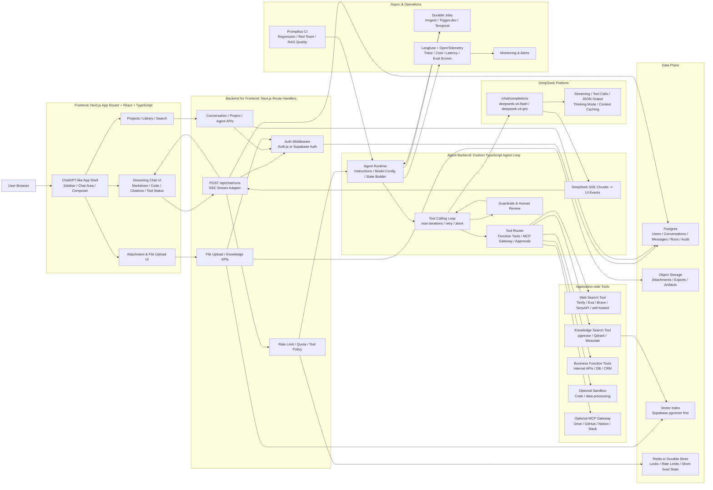
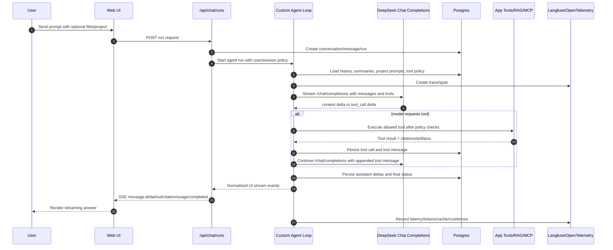
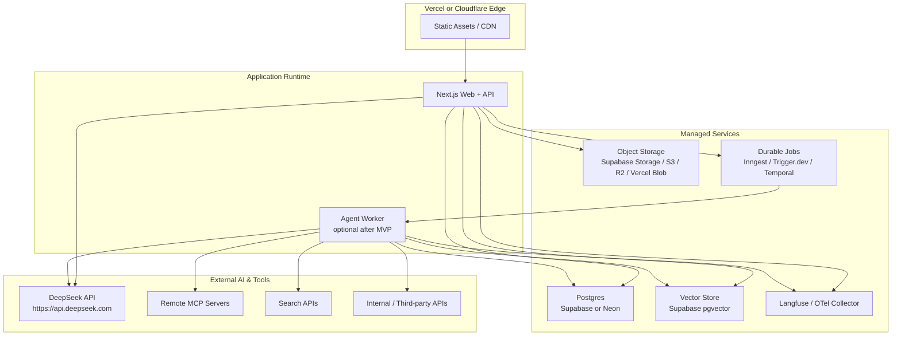

# Technical Architecture Diagram

调研日期：2026-06-17  
目标：ChatGPT-like Web Agent，前端仿 ChatGPT 信息架构，后端封装 DeepSeek API Key、自研 Agent Loop、工具、知识库与安全治理。

补充：面向“仿 Claude Code”的 Agent 后端运行时设计见 [AGENT_BACKEND_ARCHITECTURE.md](./AGENT_BACKEND_ARCHITECTURE.md)。

## Recommended Architecture

## Runtime Flow

## Module Boundaries

| Module | Responsibility | Recommended Implementation |
| --- | --- | --- |
| App Shell | ChatGPT-like layout, navigation, responsive shell | Next.js, React, Tailwind, Radix/shadcn, lucide-react |
| Chat Runtime UI | Streaming messages, tool states, citations, retry/stop | Custom components plus assistant-ui or Vercel AI SDK patterns |
| BFF/API | Auth, tenant checks, SSE, key protection, request shaping | Next.js Route Handlers; extract later if needed |
| Agent Runtime | State building, model routing, tool loop, max-iteration control | Custom TypeScript Agent Loop |
| Model Layer | DeepSeek model calls, streaming chunks, thinking mode, JSON output | DeepSeek `/chat/completions`; `@ai-sdk/deepseek` or `openai` client with DeepSeek base URL |
| Tool Layer | Function tools, MCP gateway, approvals, audit | Typed tool registry + zod/json schema + policy engine |
| Knowledge Layer | File parsing, chunking, embedding, retrieval, citations | Supabase pgvector first; Qdrant/Weaviate/Milvus later |
| Web Search Layer | Fresh web lookup with citations | Tavily/Exa/Brave Search/SerpAPI or self-hosted crawler/search |
| Persistence | Conversations, messages, runs, tool calls, audit | Postgres |
| Async Jobs | Long reports, indexing, retries, notifications | Inngest/Trigger.dev for MVP; Temporal for complex scale |
| Observability | Trace, token/cost, cache hit, errors, feedback | Langfuse + OpenTelemetry |
| Evaluation | Regression, red team, RAG eval | Promptfoo in CI |

## Deployment View

## Key Design Decisions

- Keep the browser untrusted: no DeepSeek key, tool credentials, or raw system prompts in frontend code.
- Keep the database as the product source of truth: DeepSeek Chat Completions is stateless, so the app owns conversations, summaries, runs, and tool history.
- Normalize streaming events: frontend should consume `message.delta`, `tool.*`, `citation.*`, `usage.*`, and `run.*`, not raw provider chunks.
- Execute tools only in the application layer: DeepSeek chooses tool calls, but the backend validates policy, executes tools, records audit logs, and appends tool messages.
- Use current model names: prefer `deepseek-v4-flash` and `deepseek-v4-pro`; avoid new work depending on deprecated `deepseek-chat` / `deepseek-reasoner` aliases.
- Design for context caching: keep stable prompts and project context ordered consistently so DeepSeek prefix caching can help latency and cost.
- Treat tool outputs as untrusted: web pages, files, and external APIs can carry prompt injection.
- Start as a modular monolith: Next.js BFF + Agent module is enough for MVP; extract worker service when long tasks and queue pressure appear.
- Version prompts and tools: Agent behavior is product logic, so changes need review, evals, rollback, and traceability.
