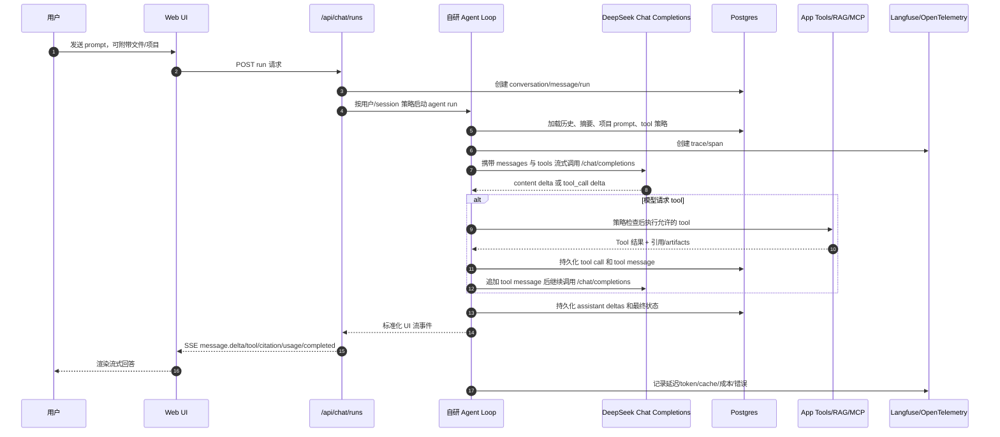
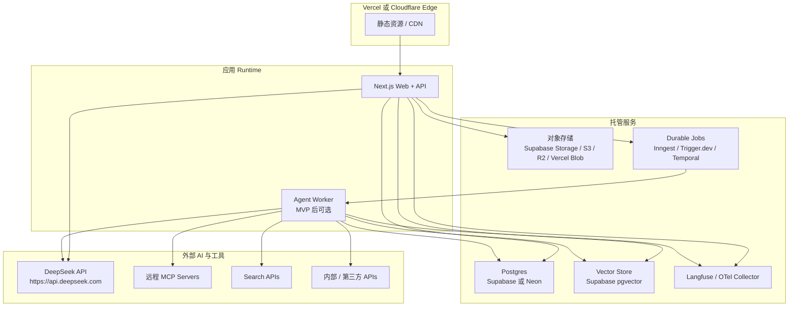

# 技术架构图

调研日期：2026-06-17  
目标：ChatGPT-like Web Agent，前端仿 ChatGPT 信息架构，后端封装 DeepSeek API Key、自研 Agent Loop、工具、知识库与安全治理。

补充：面向“仿 Claude Code”的 Agent 后端运行时设计见 [AGENT_BACKEND_ARCHITECTURE.md](./AGENT_BACKEND_ARCHITECTURE.md)。

## 推荐架构

```mermaid
flowchart LR
  User["用户浏览器"]

  subgraph FE["前端：Next.js App Router + React + TypeScript"]
    Shell["ChatGPT-like 应用外壳<br/>侧栏 / 对话区 / Composer"]
    ChatUI["流式聊天 UI<br/>Markdown / 代码 / 引用 / 工具状态"]
    UploadUI["附件与文件上传 UI"]
    ProjectUI["项目 / 库 / 搜索"]
  end

  subgraph BFF["Backend for Frontend：Next.js Route Handlers"]
    Auth["认证中间件<br/>Auth.js 或 Supabase Auth"]
    ChatAPI["POST /api/chat/runs<br/>SSE 流适配器"]
    ConvAPI["会话 / 项目 / Agent APIs"]
    FileAPI["文件上传 / 知识库 APIs"]
    Policy["限流 / 配额 / Tool 策略"]
  end

  subgraph Agent["Agent 后端：自研 TypeScript Agent Loop"]
    Runtime["Agent Runtime<br/>指令 / 模型配置 / 状态构建器"]
    Loop["Tool Calling Loop<br/>最大迭代 / 重试 / 中止"]
    ToolRouter["Tool Router<br/>Function Tools / MCP Gateway / 审批"]
    Guardrails["Guardrails 与人工复核"]
    StreamMap["DeepSeek SSE Chunks -> UI 事件"]
  end

  subgraph DeepSeek["DeepSeek 平台"]
    ChatCompletions["/chat/completions<br/>deepseek-v4-flash / deepseek-v4-pro"]
    Capabilities["Streaming / Tool Calls / JSON Output<br/>Thinking Mode / Context Caching"]
  end

  subgraph Tools["应用侧 Tools"]
    WebSearch["Web Search Tool<br/>Tavily / Exa / Brave / SerpAPI / 自建"]
    KnowledgeTool["知识检索 Tool<br/>pgvector / Qdrant / Weaviate"]
    BusinessTools["业务 Function Tools<br/>内部 APIs / DB / CRM"]
    Sandbox["可选 Sandbox<br/>代码 / 数据处理"]
    MCP["可选 MCP Gateway<br/>Drive / GitHub / Notion / Slack"]
  end

  subgraph Data["数据平面"]
    Postgres["Postgres<br/>用户 / 会话 / 消息 / Runs / 审计"]
    ObjectStore["对象存储<br/>附件 / 导出 / Artifacts"]
    Vector["向量索引<br/>优先 Supabase pgvector"]
    Redis["Redis 或 Durable Store<br/>锁 / 限流 / 短期状态"]
  end

  subgraph Async["异步与运维"]
    Jobs["Durable Jobs<br/>Inngest / Trigger.dev / Temporal"]
    Observability["Langfuse + OpenTelemetry<br/>Trace / 成本 / 延迟 / 评测分数"]
    Evals["Promptfoo CI<br/>回归 / Red Team / RAG 质量"]
    Alerts["监控与告警"]
  end

  User --> Shell
  Shell --> ChatUI
  Shell --> UploadUI
  Shell --> ProjectUI

  ChatUI --> ChatAPI
  UploadUI --> FileAPI
  ProjectUI --> ConvAPI

  ChatAPI --> Auth
  ConvAPI --> Auth
  FileAPI --> Auth
  ChatAPI --> Policy
  Policy --> Runtime

  Runtime --> Loop
  Loop --> Guardrails
  Loop --> ChatCompletions
  ChatCompletions --> Capabilities
  ChatCompletions --> StreamMap
  Loop --> ToolRouter
  ToolRouter --> WebSearch
  ToolRouter --> KnowledgeTool
  ToolRouter --> BusinessTools
  ToolRouter --> Sandbox
  ToolRouter --> MCP
  Guardrails --> Loop
  StreamMap --> ChatAPI
  ChatAPI --> ChatUI

  Auth --> Postgres
  ConvAPI --> Postgres
  ChatAPI --> Postgres
  FileAPI --> ObjectStore
  FileAPI --> Vector
  KnowledgeTool --> Vector
  Policy --> Redis

  Runtime --> Jobs
  Jobs --> Runtime
  Runtime --> Observability
  Observability --> Alerts
  Evals --> Runtime
```

## 运行流程

## 模块边界

| 模块 | 职责 | 推荐实现 |
| --- | --- | --- |
| App Shell | ChatGPT-like 布局、导航、响应式外壳 | Next.js、React、Tailwind、Radix/shadcn、lucide-react |
| Chat Runtime UI | 流式消息、tool 状态、引用、重试/停止 | 自研组件，参考 assistant-ui 或 Vercel AI SDK 模式 |
| BFF/API | Auth、租户检查、SSE、密钥保护、请求整形 | Next.js Route Handlers；后续按需拆出 |
| Agent Runtime | 状态构建、模型路由、tool loop、最大迭代控制 | 自研 TypeScript Agent Loop |
| Model Layer | DeepSeek 模型调用、streaming chunks、thinking mode、JSON output | DeepSeek `/chat/completions`；`@ai-sdk/deepseek` 或带 DeepSeek base URL 的 `openai` client |
| Tool Layer | Function tools、MCP gateway、审批、审计 | 类型化 tool registry + zod/json schema + policy engine |
| Knowledge Layer | 文件解析、chunk、embedding、检索、引用 | 优先 Supabase pgvector；后续 Qdrant/Weaviate/Milvus |
| Web Search Layer | 带引用的实时 web 检索 | Tavily/Exa/Brave Search/SerpAPI 或自建 crawler/search |
| 持久化 | Conversations、messages、runs、tool calls、audit | Postgres |
| Async Jobs | 长报告、索引、重试、通知 | MVP 使用 Inngest/Trigger.dev；复杂规模使用 Temporal |
| Observability | Trace、token/cost、cache hit、错误、反馈 | Langfuse + OpenTelemetry |
| Evaluation | 回归、red team、RAG eval | CI 中使用 Promptfoo |

## 部署视图

## 关键设计决策

- 浏览器保持不可信：前端代码中不放 DeepSeek key、tool 凭据或原始 system prompt。
- 数据库作为产品事实源：DeepSeek Chat Completions 是无状态的，因此应用负责 conversations、summaries、runs 和 tool history。
- 标准化流式事件：前端消费 `message.delta`、`tool.*`、`citation.*`、`usage.*` 和 `run.*`，不要直接消费 provider 原始 chunks。
- 只在应用层执行 tools：DeepSeek 选择 tool calls，但后端负责校验策略、执行 tools、记录审计日志，并追加 tool messages。
- 使用当前模型名：优先 `deepseek-v4-flash` 和 `deepseek-v4-pro`；避免新工作依赖已废弃的 `deepseek-chat` / `deepseek-reasoner` 别名。
- 面向 context caching 设计：稳定 prompt 和项目上下文保持一致顺序，帮助 DeepSeek prefix caching 降低延迟与成本。
- 把 tool outputs 视为不可信：网页、文件和外部 APIs 都可能携带 prompt injection。
- 从模块化单体开始：MVP 使用 Next.js BFF + Agent module 已足够；当长任务和队列压力出现后再拆出 worker service。
- 对 prompts 和 tools 做版本管理：Agent 行为是产品逻辑，因此变更需要 review、evals、rollback 和 traceability。
